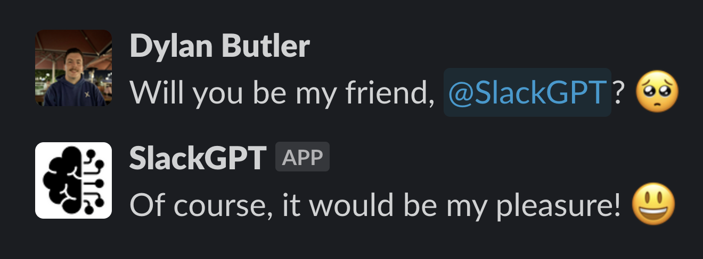

# SlackGPT

Slack bot for generating text completions using OpenAI's range of [text completion models](https://platform.openai.com/docs/models).

SlackGPT is built on top of [Slack Bot Users](https://api.slack.com/bot-users) for bot interactions and messages, [OpenAI APIs](https://platform.openai.com/docs/api-reference/introduction) for AI text completion, and GCP for sewing everything together, notable [Cloud Functions](https://cloud.google.com/functions) and [Pub/Sub](https://cloud.google.com/pubsub/docs/overview).

SlackGPT can be direct messaged privately if you need a listening ear, or added to a channel for a team's worth of fun.

## Usage

To get SlackGPT running you will need to get some external resources created and note some tokens/resource identifiers.

There are 2 ways to run SlackGPT. The first solution involves using Cloud Functions to handle events from Slack and using Pub/Sub to queue the requests, this will involve creating some additional resources withing GCP but is the preferred method to run as Cloud Functions will handle scaling for your and will generally be the cheaper and more resilient option. The second option is using [Socket Mode](https://api.slack.com/apis/connections/socket) within Slack, and keeps a connection open with Slack full time so will generally be more expensive.

### Pre-requisites

Both options will require the following setup before you get started

- OpenAI
  - Create an [OpenAI account](https://platform.openai.com/) and generate and take note of an [API Key](https://platform.openai.com/account/api-keys)
- Slack
  - Create a [Slack App](https://api.slack.com/authentication/basics)
  - Install with the following Bot Token scopes
    - `app_mentions:read`, `chat:write`
    - If using SlackGPT in channels: `channels:history`
    - If using in private channels: `groups:history`
    - If using in DMs: `im:history`
    - If using in group DMs: `mpim:history`

If using GCP you will also need the following
- GCP
  - A Project setup with APIs enabled for Cloud Functions and PubSub, take note of ProjectID

### Installation

#### Using GCP

1. Create PubSub topic and take note of topic name
   - Optionally provide request [schema](proto/request.proto) to provide validation.
2. Create a Cloud Function for receiving Slack Events, deployed from [`function.go;SlackEvent`](function.go#L11) and take note of url
   - Select "HTTP" Trigger Type and "Allow unauthenticated invocations" under Authentication
   - Provide the following environment variables (recommend using [Google Secret Manager](https://cloud.google.com/secret-manager) for sensitive values)
     - `SLACK_SINGING_SECRET` (Signing Secret from Slack app)
     - `PROJECT_ID` (GCP Project ID)
     - `PUBSUB_TOPIC` (PubSub topic created in last step)
   - Deploy
   - Update Permissions and add "Cloud Functions Invoker" for principal "allUsers"
3. Create a Cloud Function for processing requests from PubSub, deployed from [`pubsub.go;PubSubGenerate`](pubsub.go#L12)
   - Select "Cloud Pub\Sub" Trigger Type and use topic name from before
   - Provide the following environment variables (recommend using Google Secret Manager for sensitive values)
     - `OPENAI_TOKEN` (OpenAI API Key)
     - `SLACK_BOT_TOKEN` (Slack Bot token)
     - `SLACK_BOT_ID` (Slack Bot ID)
     - `MODEL` (Optional. Model for text generation. Defaults to "text-davinci-003")
   - Deploy
4. Enable Events for your Slack App
   - Paste Request URL generated from Step 2 above
   - Subscribe to the following bot events
     - `app_mention`
     - `message.im`
5. Profit

#### Using Socketmode

1. Create a Slack [App-Level Token](https://api.slack.com/authentication/token-types) for your app and take note of the token
2. Run [`cmd/socket/main.go`](cmd/socket/main.go#L18), providing following environment variables
   - `OPENAI_TOKEN` (OpenAI API Key)
   - `SLACK_APP_TOKEN` (Slack App Token)
   - `SLACK_BOT_TOKEN` (Slack Bot token)
   - `SLACK_BOT_ID` (Slack Bot ID)
   - `MODEL` (Optional. Model for text generation. Defaults to "text-davinci-003")
3. Profit

### Contributing

This was just an afternoon project and is likely to go unmaintained in the future, but any PRs are always welcome :smile: